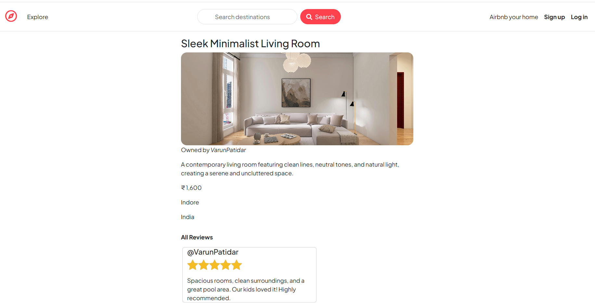
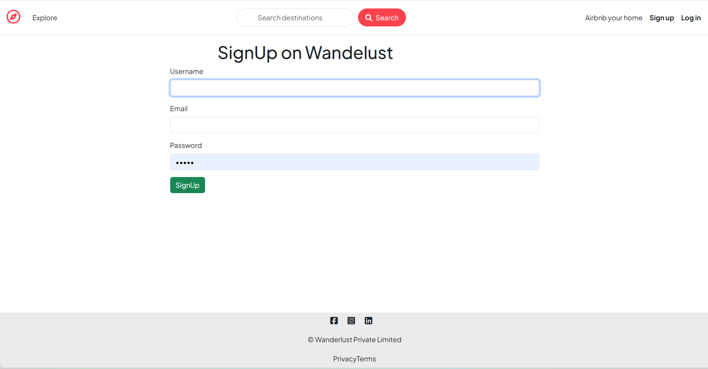
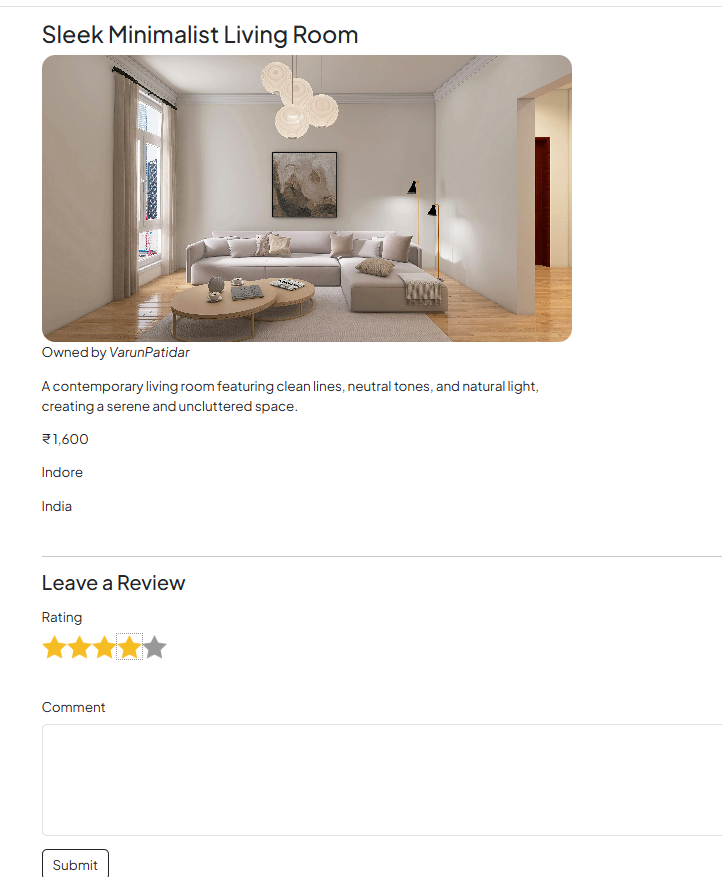

# 🏡 Wanderlust — Airbnb Clone

A full-stack **Airbnb-inspired accommodation listing web application** built using **Node.js, Express.js, MongoDB, Mongoose, EJS, Passport.js, and Cloudinary**.

Wanderlust allows users to discover accommodation listings, create their own listings, upload property images, manage their listings, leave reviews, and securely authenticate using session-based authentication.

🌐 Live Demo:
 https://varunbnb.onrender.com
 
 The project is deployed using **Render**.

> Note: Render free-tier services can take some time to wake up after inactivity.

## 📸 Project Preview

### 🏠 Listings Page

.png)

### 🏡 Listing Details



### 🔐 Login

.png)

### 📝 Signup



### ⭐ Reviews



---

# ✨ Features

## 🔐 Authentication & Authorization

* User signup and login
* User logout
* Session-based authentication using Passport.js
* Password authentication using Passport Local Strategy
* Protected routes for authenticated users
* Authorization for listing owners
* Authorization for review authors
* Automatic redirect to the originally requested page after login

---

## 🏠 Listing Management

Users can:

* View all available listings
* View individual listing details
* Create new listings
* Edit their own listings
* Delete their own listings
* Upload listing images
* Add title, description, price, location, country and category
* Filter listings by category

## ⭐ Reviews & Ratings

Users can interact with listings through a review system.

* Add reviews
* Give ratings from 1 to 5
* Display review authors
* Delete reviews created by the current user
* Validate review data using Joi
* Associate reviews with their respective listings

Listings and reviews are connected using MongoDB references.

---

## 🖼️ Cloudinary Image Upload

Listing images are uploaded using:

* Multer
* Multer Storage Cloudinary
* Cloudinary

Images are stored in the Cloudinary folder:

```text
wanderlust_DEV
```

The application stores the Cloudinary image URL and filename in MongoDB.

---

## 🗄️ Database

The application uses:

**MongoDB Atlas + Mongoose**

Main database models:

```text
User
Listing
Review
```

# 🛠️ Tech Stack

| Category                | Technology            |
| ----------------------- | --------------------- |
| Runtime                 | Node.js               |
| Backend                 | Express.js            |
| Frontend                | HTML, CSS, JavaScript |
| Templating              | EJS                   |
| Template Layouts        | EJS-Mate              |
| Database                | MongoDB Atlas         |
| ODM                     | Mongoose              |
| Authentication          | Passport.js           |
| Authentication Strategy | Passport Local        |
| Sessions                | Express Session       |
| Session Store           | Connect Mongo         |
| Image Upload            | Multer                |
| Cloud Storage           | Cloudinary            |
| Validation              | Joi                   |
| Flash Messages          | Connect Flash         |
| HTTP Method Override    | Method Override       |
| Deployment              | Render                |

---

# 📂 Project Structure

```text
Wanderlust/
│
├── controllers/
│   ├── listings.js
│   ├── reviews.js
│   └── users.js
│
├── models/
│   ├── listing.js
│   ├── review.js
│   └── user.js
│
├── routes/
│   ├── listing.js
│   ├── review.js
│   └── user.js
│
├── views/
│   ├── layouts/
│   ├── listings/
│   ├── users/
│   ├── includes/
│   └── error.ejs
│
├── public/
│   ├── css/
│   └── js/
│
├── utils/
│   ├── ExpressError.js
│   └── wrapAsync.js
│
├── app.js
├── middleware.js
├── schema.js
├── cloudConfig.js
├── package.json
├── package-lock.json
├── .gitignore
└── README.md
```

# 🔐 Environment Variables

The application requires environment variables for database, authentication/session management and Cloudinary.

Create a `.env` file in the root directory:

```env
ATLASDB_URL=your_mongodb_atlas_connection_string

SECRET=your_session_secret

CLOUD_NAME=your_cloudinary_cloud_name
CLOUD_API_KEY=your_cloudinary_api_key
CLOUD_API_SECRET=your_cloudinary_api_secret
```

> ⚠️ Never commit your `.env` file or API credentials to GitHub.

Add this to `.gitignore`:

```gitignore
node_modules/
.env
```

---

# 🚀 Installation

## 1. Clone the Repository

```bash
git clone https://github.com/YOUR-USERNAME/YOUR-REPOSITORY.git
```

Replace the URL above with your GitHub repository URL.

---

## 2. Navigate to the Project

```bash
cd Wanderlust
```

---

## 3. Install Dependencies

```bash
npm install
```

---

## 4. Configure Environment Variables

Create:

```text
.env
```

Then add:

```env
ATLASDB_URL=your_mongodb_atlas_connection_string
SECRET=your_session_secret
CLOUD_NAME=your_cloudinary_cloud_name
CLOUD_API_KEY=your_cloudinary_api_key
CLOUD_API_SECRET=your_cloudinary_api_secret
```

---

## 5. Start the Application

```bash
node app.js
```

The application runs on:

```text
http://localhost:8080
```

Open:

```text
http://localhost:8080/listings
```


# 🧹 Async Error Handling

The project uses a reusable `wrapAsync` utility to handle asynchronous Express route/controller errors.

Instead of repeating:

```js
try {
    // async code
} catch(err) {
    next(err);
}
```

controllers can use:

```js
wrapAsync(controllerFunction)
```

This keeps route definitions cleaner and centralizes error handling.

---

# 📚 What I Learned

Building Wanderlust helped me gain practical experience with:

* Node.js backend development
* Express.js
* MVC architecture
* RESTful routing
* MongoDB database design
* Mongoose relationships
* CRUD operations
* Passport.js authentication
* Session management
* Authorization middleware
* Joi validation
* Multer file uploads
* Cloudinary integration
* EJS templating
* EJS-Mate layouts
* Flash messages
* Error handling
* Middleware design
* Git and GitHub
* Deployment using Render

# ⭐ Support

If you found this project useful or interesting, consider giving the repository a ⭐ on GitHub.


                

